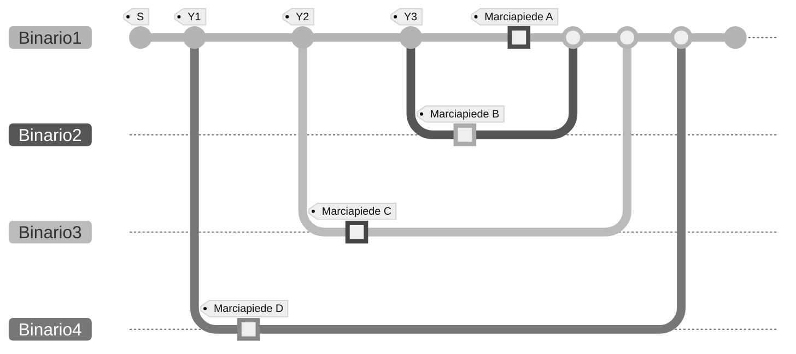

# :steam_locomotive: Railway Interchange

For this homework, we want to design a switch system for entering a train station; there is only one track arriving at the station and only one track departing from it, but there are four platforms available, labeled $A$, $B$, $C$, and $D$. Each platform has its own track, as shown in the following figure:

One train arrives at the station at a time, but trains can wait on the platforms for any amount of time. Normally, an arriving train is directed to platform $A$. If platform $A$ is occupied, it is directed to platform $B$. If both platforms $A$ and $B$ are occupied, the train is directed to platform $C$; finally, if $A$, $B$, and $C$ are occupied, the train is transferred to platform $D$. A free platform is represented by the value 0, while an occupied platform is represented by the value 1.

Then there is a traffic light $S$ which is kept at 1 (green) if there are free platforms and set to 0 (red) if they are all occupied, in order to stop any other convoy arriving at the station entrance.

Trains are directed via three switches:

- $Y1$ is set to 1 if the train can continue to travel on track 1, while it is set to $0$ to indicate that the train must be transferred to track 4;
- $Y2$ is set to 1 if the train can continue to travel on track 1, while it is set to $0$ to indicate that the train must be transferred to track 3;
- $Y3$ is set to 1 if the train can continue to travel on track 1, while it is set to $0$ to indicate that the train must be transferred to track 2.

Design the logic circuit that allows you to control the values ​​of $Y1$, $Y2$, $Y3$ and $S$ as a function of the state of the other variables.

## How to make the circuit

The study of the problem, the analysis of the circuit and its minimization can be done on paper. The obtained circuit must be inserted into the file `circuit.dig`, which can be modified using the circuit editor and simulator [Digital](https://github.com/hneemann/Digital). The simulator also allows you to test the circuit locally, so you can also verify the correctness of the proposed solution locally.

The inputs and outputs of the circuit are already specified in the `circuit.dig` file. Do not rename these terminals, otherwise the submitted homework cannot be evaluated.
